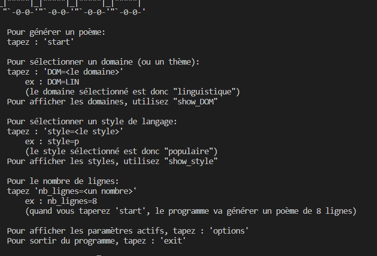

## Générateur de poèmes

Créateur de poèmes personnalisés selon des caractéristiques définies par l'utilisateur.
Il y aura pour cela différents thèmes de génération : **physique, mythologie, psychologie, …**
ainsi que différents styles de langages : **populaire, littéraire, famillier, …**.
Pour générer un poème, le programme se basera sur la base de données __*DEM (Dictionnaire Électronique des Mots)*__.

## Utilisation
Afin d'utiliser le programme, veuillez éxecuter le fichier <code>start.py</code> situé dans le dossier <code>Code_poeme/</code> 

### Comment lancer le programme ?

* Se déplacer dans le répertoire 'Code_poeme': 

  * <code>python start.py</code>
  * 
* Suivre les instructions de la console.
#### Avec l'interface graphique de votre système d'exploitation
* Se déplacer dans le répertoire 'Code_poeme'.
* Cliquer sur le fichier <code>start.py</code>.
* Suivre les instructions de la console.

